# Telegram Bot Project

Este proyecto es un bot de Telegram construido con Node.js y utiliza la biblioteca `node-telegram-bot-api` para interactuar con la API de Telegram. El bot puede responder a comandos específicos enviados por usuarios, gestionar eventos desde una API externa y ejecutar comandos de sistema como apagar la computadora. Además, de crear una extensión de chrome para obtener información de canales terceros

## Características

- **Responder a comandos básicos**: Responde a un saludo y proporciona información dinámica sobre eventos.
- **Consulta de eventos**: Accede a una API externa para listar eventos y obtener detalles específicos de un evento.
- **Control de sistema**: Permite apagar la computadora donde se ejecuta el bot a través de un comando de Telegram (con restricciones de seguridad).
- **Escucha de canales**: Permite escuchar información de terceros y reenviarlo al bot

## Estructura del Proyecto

El proyecto está organizado en varios módulos para mantener el código limpio y fácil de mantener:

- `index.js`: Archivo principal que inicia el bot y registra los manejadores de eventos.
- `config.js`: Contiene las configuraciones como el token de Telegram y URLs de la API.
- `event_handlers.js`: Define los manejadores de eventos para los comandos del bot.
- `commands.js`: Contiene la lógica para los comandos del bot que interactúan con la API externa y otros comandos.
- `utilities.js`: Funciones auxiliares, como apagar la computadora.
-`content.js`: Archivo de escucha para el bot.

## Capturas de los ejercicios

1. Enviar mensajes y archivos a través de Telegram desde la línea de comando  
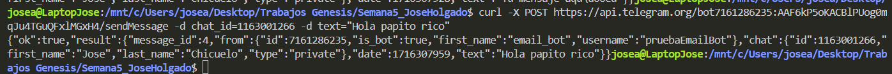  
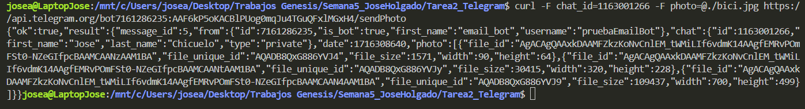  
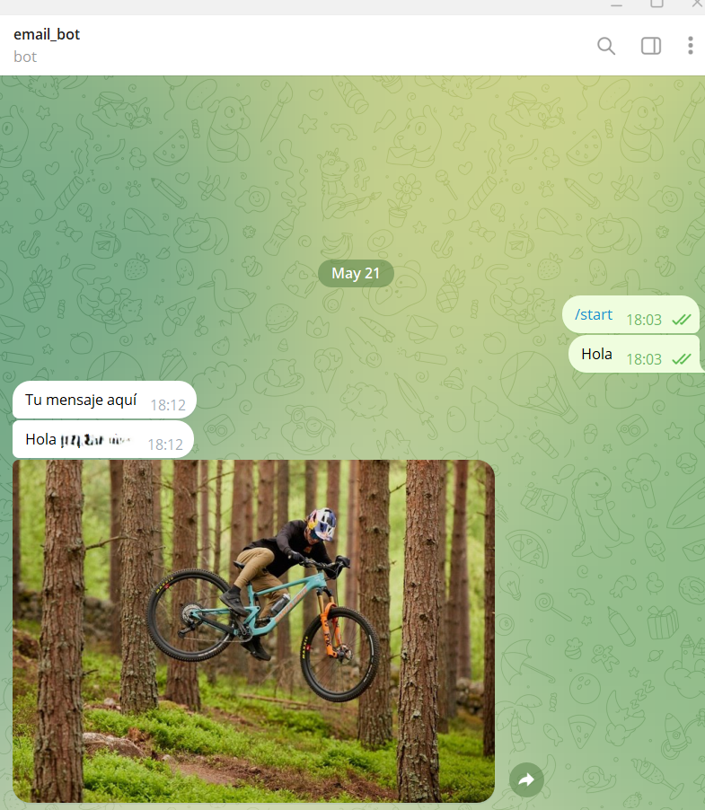

2. Crear un bot que te dé la bienvenida cada vez que digas '/hi'  
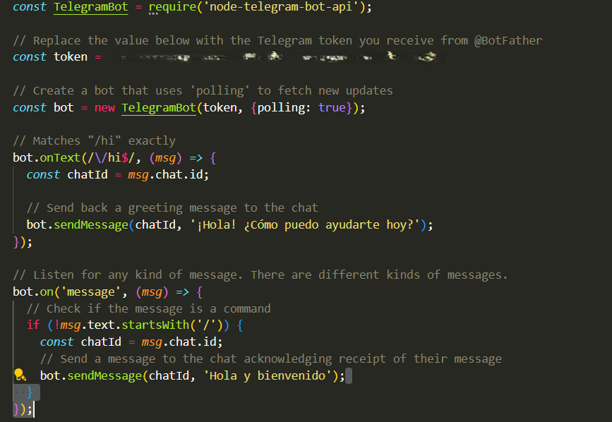  
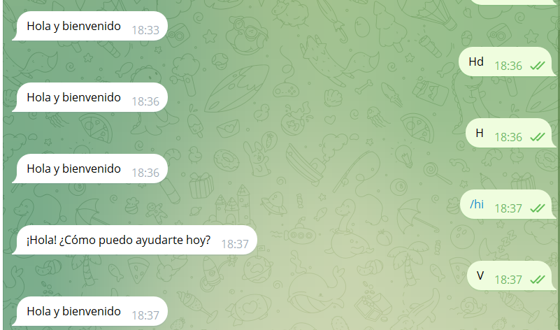

3. Conectar el bot con la API de Nodejs y solicitar la lista de eventos y la información específica del evento  
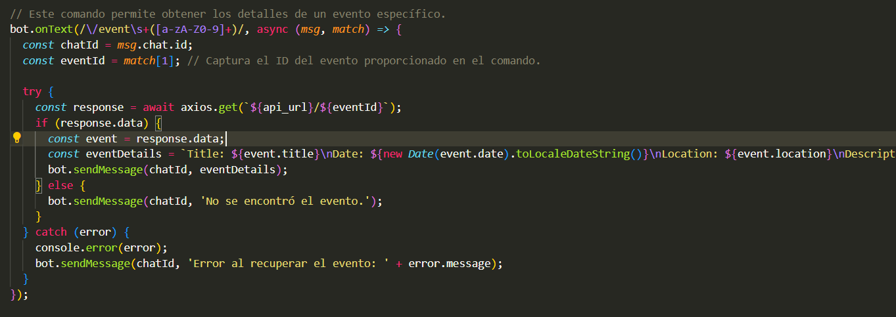  
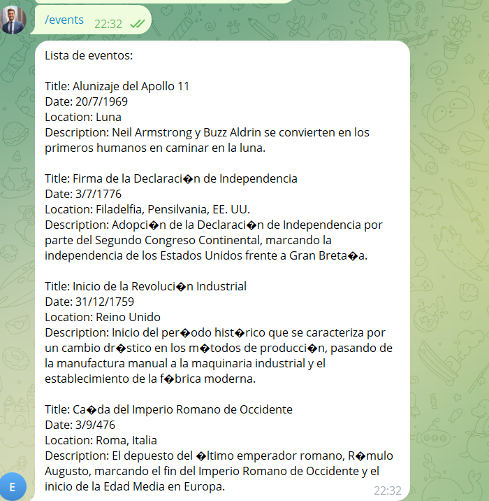  
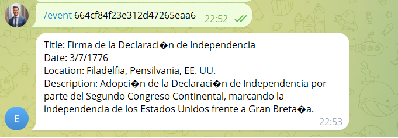

4. Agregar un comando al bot que apague la computadora en los siguientes N segundos  
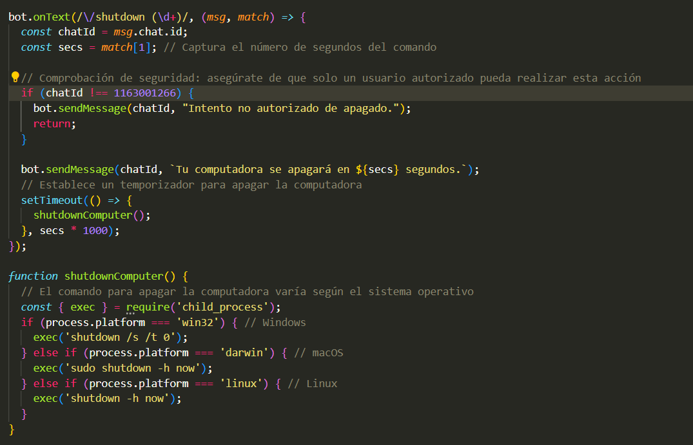  
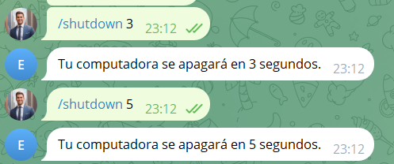

5. Cada vez que recibas un nuevo correo electrónico de Gmail léelo en Telegram  
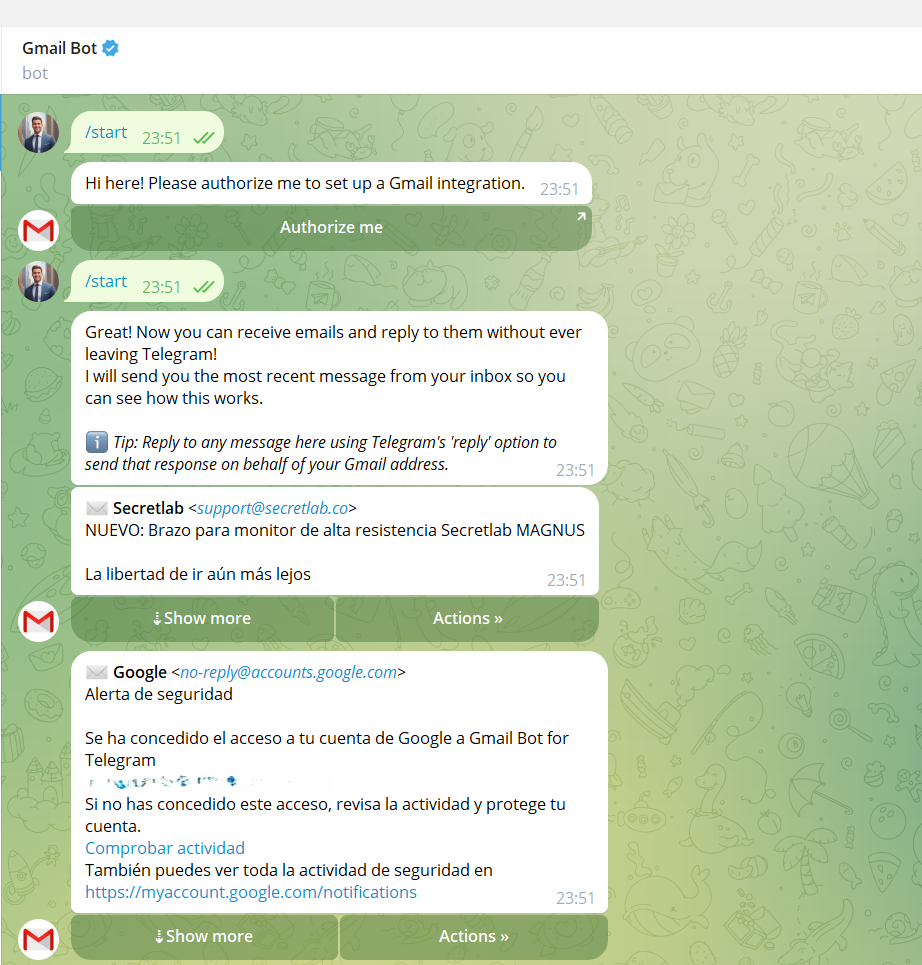

6. Crear una extensión en Chrome que escuche mensajes de terceros y los reenvíe al bot  
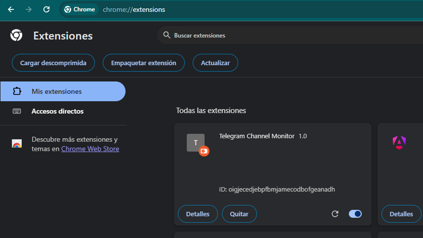  
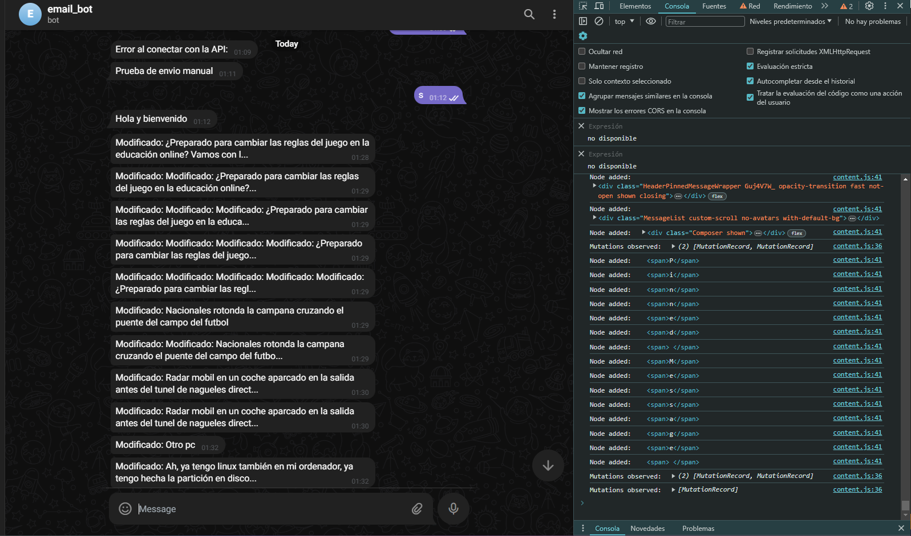

## Requisitos

Para ejecutar este proyecto, necesitarás:

- Node.js instalado en tu sistema.
- Un bot de Telegram y su token correspondiente. Puedes obtener uno a través de BotFather en Telegram.
-chrome
